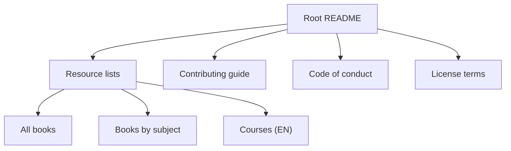
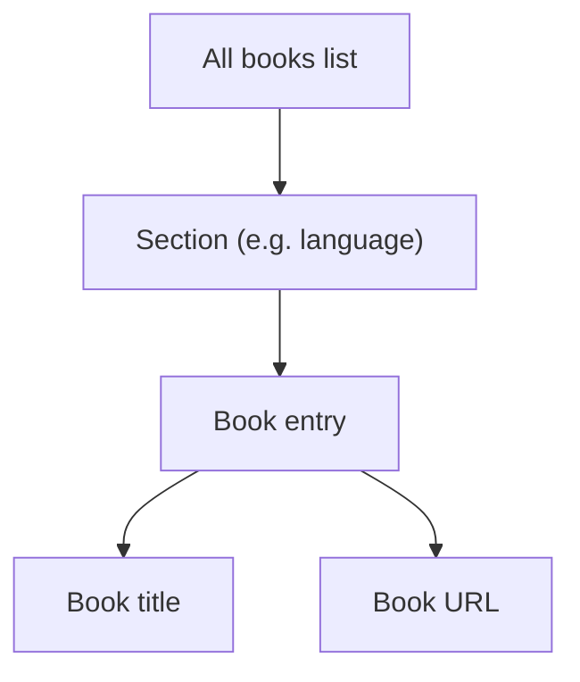
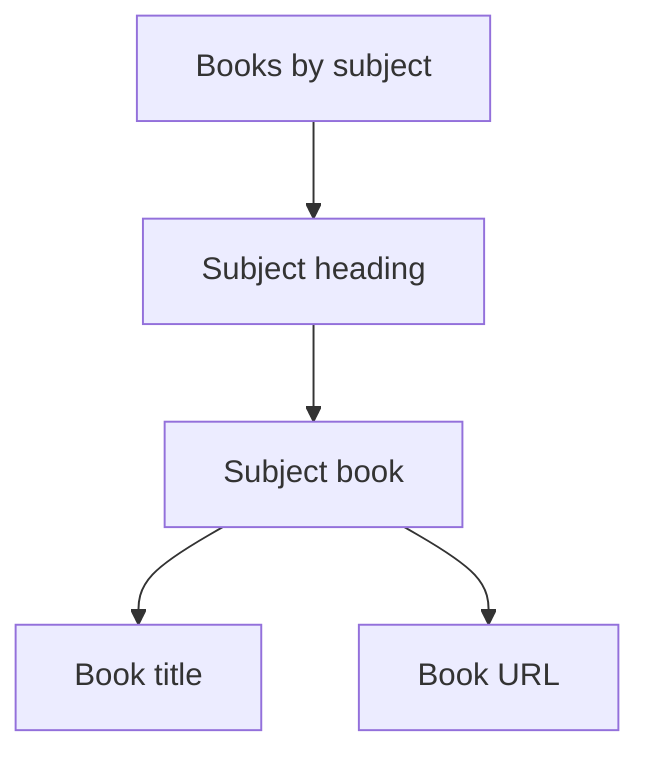
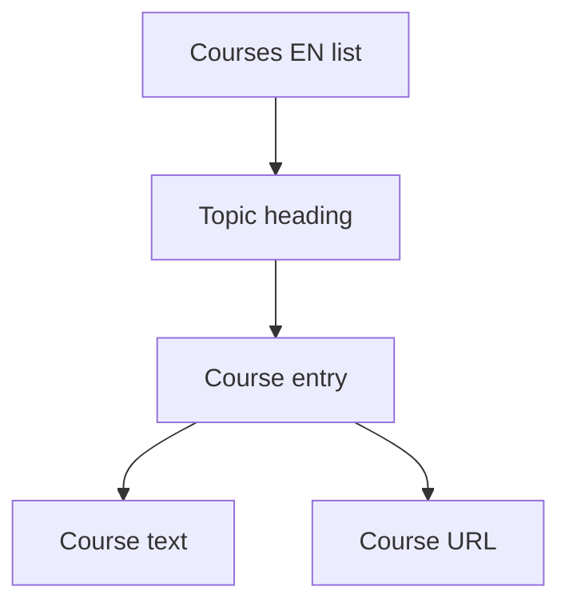
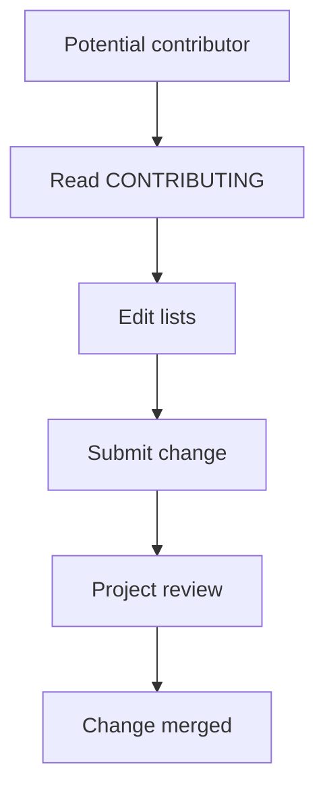
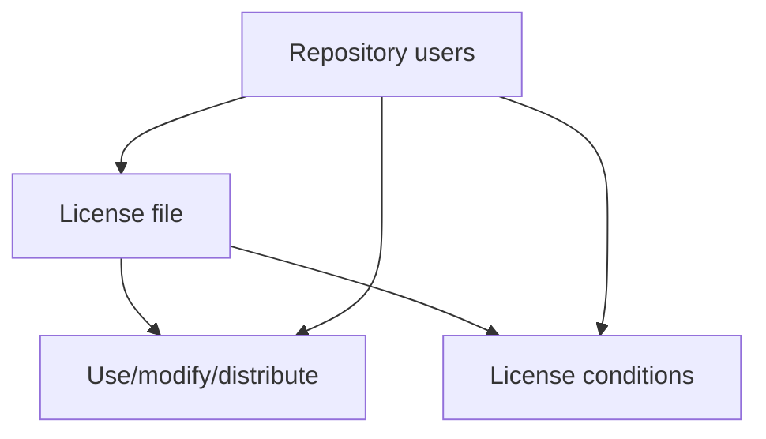
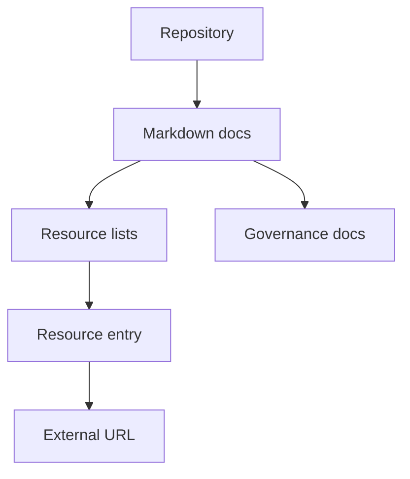

# Project Overview

**Related Files**:
- `README.md`

**Related Pages**:
- Collection Organization and Categories
- Repository Structure

<details>
<summary>Relevant source files</summary>

The following files were used as context for generating this wiki page:

- [README.md](https://github.com/screwedupclick/freeprogrammingbooks/blob/main/README.md)
- [books/free-programming-books.md](https://github.com/screwedupclick/freeprogrammingbooks/blob/main/books/free-programming-books.md)
- [books/free-programming-books-subjects.md](https://github.com/screwedupclick/freeprogrammingbooks/blob/main/books/free-programming-books-subjects.md)
- [books/free-courses-en.md](https://github.com/screwedupclick/freeprogrammingbooks/blob/main/books/free-courses-en.md)
- [CONTRIBUTING.md](https://github.com/screwedupclick/freeprogrammingbooks/blob/main/CONTRIBUTING.md)
- [CODE_OF_CONDUCT.md](https://github.com/screwedupclick/freeprogrammingbooks/blob/main/CODE_OF_CONDUCT.md)
- [LICENSE](https://github.com/screwedupclick/freeprogrammingbooks/blob/main/LICENSE)
</details>

# Project Overview

## Introduction

This project is a curated collection of free programming books and learning resources, organized primarily as Markdown lists. It serves as a centralized index pointing to external educational content, such as books, courses, and subject-specific materials, rather than hosting the content itself. The repository is structured for easy navigation, contribution, and reuse under a permissive license.  
Sources: [README.md:1-10](), [books/free-programming-books.md:1-40](), [books/free-programming-books-subjects.md:1-40](), [books/free-courses-en.md:1-40]()

The core of the project comprises categorized lists of resources, separated by type (books vs. courses) and further refined by subject and language. Contribution guidelines, a code of conduct, and licensing information define how community members can safely and consistently extend the collection.  
Sources: [README.md:1-40](), [CONTRIBUTING.md:1-160](), [CODE_OF_CONDUCT.md:1-120](), [LICENSE:1-30]()

## High-Level Architecture

At a high level, the repository is a documentation-centric project with these main components:

- A root README describing the project.
- Multiple Markdown lists of resources, grouped by category.
- Contribution and governance documents.
- A license defining reuse rights.  
Sources: [README.md:1-40](), [books/free-programming-books.md:1-40](), [books/free-programming-books-subjects.md:1-40](), [books/free-courses-en.md:1-40](), [CONTRIBUTING.md:1-40](), [CODE_OF_CONDUCT.md:1-40](), [LICENSE:1-30]()

### Component Relationship Diagram

The following diagram shows how the main documents relate conceptually.



This diagram reflects the README acting as an entry point, linking conceptually to lists of resources and project governance documents.  
Sources: [README.md:1-40](), [books/free-programming-books.md:1-40](), [books/free-programming-books-subjects.md:1-40](), [books/free-courses-en.md:1-40](), [CONTRIBUTING.md:1-40](), [CODE_OF_CONDUCT.md:1-40](), [LICENSE:1-30]()

### Main Components Summary

| Component                    | Role                                                                 |
|-----------------------------|----------------------------------------------------------------------|
| `README.md`                 | Top-level description and overview of the repository                |
| `books/free-programming-books.md` | Global list of free programming books, often by language/topic  |
| `books/free-programming-books-subjects.md` | Subject-indexed list of free programming books         |
| `books/free-courses-en.md`  | English-language free course list                                   |
| `CONTRIBUTING.md`           | Rules and process for adding or editing resources                   |
| `CODE_OF_CONDUCT.md`        | Community behavior expectations and enforcement process             |
| `LICENSE`                   | Legal terms for using and sharing the list content                  |

Sources: [README.md:1-40](), [books/free-programming-books.md:1-40](), [books/free-programming-books-subjects.md:1-40](), [books/free-courses-en.md:1-40](), [CONTRIBUTING.md:1-80](), [CODE_OF_CONDUCT.md:1-80](), [LICENSE:1-30]()

## Resource Lists

### Global Free Programming Books List

The `books/free-programming-books.md` file is a central index of free programming books. It is structured as a Markdown document containing sections grouped by criteria such as language or topic, with each section providing bullet-pointed links to external resources.  
Sources: [books/free-programming-books.md:1-200]()

Each entry typically consists of:

- A title
- Possibly an author or source indication in text
- A URL to the external resource  
Sources: [books/free-programming-books.md:40-200]()

#### Conceptual Structure Diagram



This diagram models repeated patterns in the main books list: sections contain multiple entries, each entry connecting descriptive text with a link.  
Sources: [books/free-programming-books.md:1-200]()

### Subject-Indexed Books List

The `books/free-programming-books-subjects.md` file organizes free programming books by subject area rather than just language or broad category. It uses Markdown headings to denote subjects and lists of bullet-pointed resources under each.  
Sources: [books/free-programming-books-subjects.md:1-200]()

Subjects are represented as headings, and under each heading, entries mirror the structure found in the main books list: short descriptive text plus a URL.  
Sources: [books/free-programming-books-subjects.md:40-200]()

#### Subject Index Diagram



This illustrates the subject-centric grouping of resources.  
Sources: [books/free-programming-books-subjects.md:1-200]()

### Free Courses (English) List

The `books/free-courses-en.md` file lists free programming-related courses in English. It follows the same Markdown pattern: headings for categories or topics and bullet lists with course information and links.  
Sources: [books/free-courses-en.md:1-200]()

Each course entry consists of human-readable text describing the course and at least one URL pointing to the external course provider.  
Sources: [books/free-courses-en.md:40-200]()

#### Courses Structure Diagram



This reflects how English-language courses are categorized and listed.  
Sources: [books/free-courses-en.md:1-200]()

### Resource Types Summary

| File                                      | Primary Type         | Grouping Dimension          |
|-------------------------------------------|----------------------|-----------------------------|
| `books/free-programming-books.md`         | Books                | Language / high-level topic |
| `books/free-programming-books-subjects.md`| Books                | Subject                     |
| `books/free-courses-en.md`                | Courses              | Topic (English only)        |

Sources: [books/free-programming-books.md:1-200](), [books/free-programming-books-subjects.md:1-200](), [books/free-courses-en.md:1-200]()

## Contribution Workflow

### Contribution Guidelines

`CONTRIBUTING.md` defines how users propose additions or changes to the resource lists. It lays out expectations on formatting, correctness, and the general process for contributing via the repository’s standard development platform mechanisms (e.g., issues and pull requests as implied by the presence of a contributing guide).  
Sources: [CONTRIBUTING.md:1-160]()

The document specifies that contributors must follow repository-specific conventions to ensure consistency across the lists, such as:

- Adhering to established Markdown styles for entries.
- Positioning new entries in the correct section and order.
- Complying with project policies when editing existing content.  
Sources: [CONTRIBUTING.md:20-160]()

#### Conceptual Contribution Flow



This diagram abstractly models the intended contribution lifecycle described conceptually in the contributing guide.  
Sources: [CONTRIBUTING.md:1-160]()

### Community Standards (Code of Conduct)

`CODE_OF_CONDUCT.md` defines acceptable behavior and outlines enforcement practices. It includes:

- Standards for respectful communication.
- Examples of unacceptable behavior.
- Responsibilities of maintainers.
- Reporting and enforcement guidelines.  
Sources: [CODE_OF_CONDUCT.md:1-120]()

The document associates project participation with adherence to these rules, enabling a safe and inclusive contribution environment.  
Sources: [CODE_OF_CONDUCT.md:40-120]()

#### Code of Conduct Interaction Diagram (Sequence)

```mermaid
sequenceDiagram
  autonumber
  participant U as User
  participant C as Community
  participant M as Maintainer

  U->>+C: Participate in project
  Note over U,C: Behavior governed by Code of Conduct
  C->>M: Report violation
  M-->>C: Acknowledge report
  M->>M: Evaluate behavior
  alt Behavior acceptable
    M-->>C: No action
  else Behavior unacceptable
    M-->>U: Communicate consequences
  end
  M-->>-C: Apply enforcement
```

This diagram represents the process described conceptually in the code of conduct for handling behavior and potential violations.  
Sources: [CODE_OF_CONDUCT.md:40-120]()

## Licensing and Reuse

The `LICENSE` file applies a permissive license to the contents of the repository. It grants broad rights to use, copy, modify, and distribute the repository’s content, subject to the conditions defined in the text.  
Sources: [LICENSE:1-30]()

### Licensing Model Overview



This diagram highlights the relationship between users, granted rights, and obligations defined in the license.  
Sources: [LICENSE:1-30]()

## Root README Role

`README.md` provides the top-level entry point to the repository. It identifies the project concisely and serves as a natural location for links to the main lists and governance documents.  
Sources: [README.md:1-10]()

The README’s concise nature aligns with the project’s role as a catalog; it orients readers quickly to the fact that this is a collection of resources rather than an executable software codebase.  
Sources: [README.md:1-10]()

## Overall Data Model

Even though the project consists of Markdown documents, it can be viewed as a logical data model of categorized external resources.

### Logical Data Model Diagram



This diagram summarizes the project as a repository of documents that either define resources (lists) or define rules (governance), with each resource entry pointing externally.  
Sources: [README.md:1-40](), [books/free-programming-books.md:1-200](), [books/free-programming-books-subjects.md:1-200](), [books/free-courses-en.md:1-200](), [CONTRIBUTING.md:1-160](), [CODE_OF_CONDUCT.md:1-120](), [LICENSE:1-30]()

## Summary

The project is a documentation-centric repository that indexes free programming books and related courses through structured Markdown lists. The main lists cover all books, subject-specific books, and English-language courses, all of which reference external content via URLs. Contribution, community behavior, and licensing are specified through dedicated documents, allowing the resource catalog to grow in a consistent, inclusive, and legally clear way.  
Sources: [README.md:1-40](), [books/free-programming-books.md:1-200](), [books/free-programming-books-subjects.md:1-200](), [books/free-courses-en.md:1-200](), [CONTRIBUTING.md:1-160](), [CODE_OF_CONDUCT.md:1-120](), [LICENSE:1-30]()
